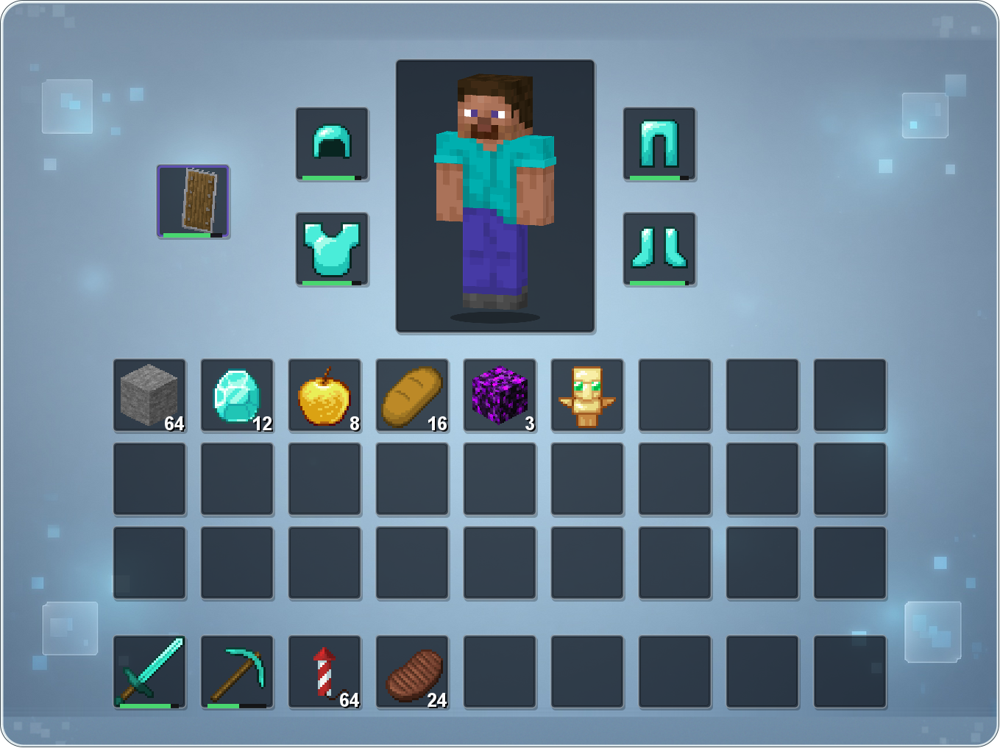
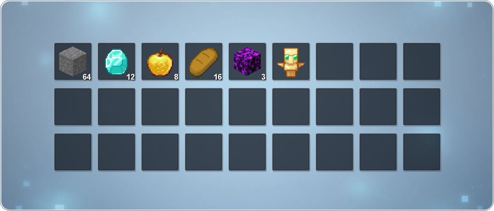

# HuHoBotInventory

让群友在 QQ 群里直接查看自己 Minecraft 账号的背包和末影箱。

玩家完成绑定后，只要发送 `/我的背包` 或 `/我的末影箱`，机器人就会回复一张图片。玩家不在线时，匹配的 Paper 版本会优先读取原版玩家数据；其他平台或读取失败时使用插件自己的最近快照。





## 这个插件能做什么

- 查询自己已绑定账号的背包和末影箱。
- 同时绑定两个账号时，用按钮选择要查询的账号。
- 玩家离线后，直接查看 Paper 保存的背包和末影箱数据。
- 管理员可以直接查询指定的在线玩家。
- 正确显示玩家皮肤、盔甲、玩家头颅和常用物品贴图。
- 自带一张默认底图，也可以换成服主自己的 PNG 图片。

## 使用前需要什么

- Spigot 或 Paper 1.21.11 服务端。Paper 1.21.11 可以直接只读查询原版 playerdata；其他 Bukkit 实现会使用插件保存的 YAML 快照。
- [HuHoBot-Penguin 1.3.0](https://github.com/HuHoBot/PenguinClient) 的 **Spigot / Paper 版**，JAR 文件名为 `HuHoBot-Penguin_Spigot-1.3.0.jar`。
- [GameAuthCode](https://github.com/RiegaLee/HuHoBotGameAuthCode)，用于把 QQ 和游戏账号绑定起来。
- AuthMeReloaded，用于确认绑定的是玩家本人。
- SkinsRestorer 为可选插件；安装后可以提高自定义皮肤的读取成功率。

HuHoBot-Penguin 主项目还提供 Nukkit、Allay 以及 BungeeCord / Velocity 版本；这些是不同服务端平台的独立产物。本插件属于 Bukkit / Paper Addon，应与上面的 Spigot / Paper 版一起安装。

## 安装

1. 从 [Releases](https://github.com/RiegaLee/HuHoBotInventory/releases/latest) 下载最新 JAR。
2. 把 JAR 放进服务端的 `plugins/` 文件夹。
3. 确认 HuHoBot-Penguin、AuthMeReloaded 和 GameAuthCode 已经可以正常使用。
4. 完整重启服务器。
5. 在 HuHoBot 的已安装扩展中看到 `HuHoBotInventory`，就表示安装成功。

第一次启动后，配置文件会出现在：

```text
plugins/HuHoBotInventory/config.yml
```

默认配置可以直接使用。

## 玩家怎么绑定账号

1. 进入 Minecraft 服务器并完成登录。
2. 在游戏中输入 `/authcode`，获得六位验证码。
3. 回到 QQ 群发送 `/绑定 验证码`。
4. 机器人提示绑定成功后，就可以查询背包和末影箱。

如需绑定第二个账号，换另一个游戏账号重复一次即可。

## QQ 群命令

### 玩家命令

| 命令 | 用途 |
| --- | --- |
| `/我的背包` | 查看自己的背包 |
| `/我的背包 1` | 查看绑定列表中的第一个账号 |
| `/我的背包 2` | 查看绑定列表中的第二个账号 |
| `/我的末影箱` | 查看自己的末影箱 |
| `/我的末影箱 1` | 查看第一个账号的末影箱 |
| `/我的末影箱 2` | 查看第二个账号的末影箱 |

绑定多个账号时，机器人会优先发送账号选择按钮。按钮在 60 秒内有效，选择完成或过期后会自动撤回。

### 管理员命令

| 命令 | 用途 |
| --- | --- |
| `/背包查看 <在线玩家名>` | 查看指定在线玩家的背包 |
| `/末影箱查看 <在线玩家名>` | 查看指定在线玩家的末影箱 |

管理员查询只接受当前在线玩家的准确游戏名。

## 离线查询是怎么工作的

在匹配的 Paper 1.21.11 上查询离线玩家时，插件首先以只读方式读取服务器当前世界的 `playerdata/<UUID>.dat`。它只读取与绑定 UUID 完全对应的文件，不会写回、替换或删除玩家存档。

为了避免在玩家上线或存档正被改写时读到不一致的数据，插件会在读取前后检查玩家在线状态、文件大小和修改时间。检测到状态变化时，本次查询会中止，让用户重新查询。

原版存档读取器是一个按平台和游戏版本延迟加载的适配器，不会在不匹配的服务端上加载 Paper 内部类。Spigot 或暂未适配的版本会直接使用 YAML 快照。快照会在这些时候更新：

- 玩家退出服务器时；
- 插件定时保存时；
- 服务器正常关闭时。

如果原版存档不存在、损坏或暂时无法读取，插件会自动尝试最近的 YAML 快照。两种数据都没有时，才会提示暂时没有离线数据。若提示“未经游戏内验证”，需要重新使用 GameAuthCode 完成绑定。

## 更换底图

插件自带雾蓝色默认底图，不修改配置也能直接使用。

如需换成自己的图片：

1. 先启动一次插件。
2. 把 PNG 图片放进：

   ```text
   plugins/HuHoBotInventory/assets/custom/backgrounds/
   ```

3. 修改 `config.yml`：

   ```yaml
   render:
     custom-background:
       enabled: true
       inventory-file: inventory.png
       ender-chest-file: ""
       fit: cover
   ```

4. 完整重启服务器。

`ender-chest-file` 留空时，背包和末影箱共用一张底图；填写 `ender.png` 等文件名时，可以分别使用两张图片。

- `cover`：保持图片比例，居中裁掉多余部分，通常效果最好。
- `stretch`：把图片直接拉伸到整个画布。

推荐背包底图尺寸为 `1359×1017`。插件会自动在底图上绘制圆角物品格和人物区域，自己的图片里不需要提前画格子。

底图必须是 PNG，文件名只能使用英文字母、数字、点、下划线和连字符。单个文件不能超过 16 MiB，图片总像素不能超过 3200 万。

## 常见问题

### 发送命令后提示没有绑定

先确认玩家已经在游戏内登录，并使用 `/authcode` 获取验证码，然后在 QQ 群重新发送 `/绑定 验证码`。

### 玩家在线，但管理员查询不到

管理员命令需要完整、准确的在线玩家名，不能使用昵称或模糊匹配。

### 皮肤没有显示

插件会先尝试读取玩家当前皮肤，失败后使用内置默认皮肤。离线服或使用第三方皮肤系统时，建议安装 SkinsRestorer。

### 自定义底图启用后插件无法启动

检查文件是否放在正确目录、文件名是否与配置一致，以及图片是否超过大小限制。控制台日志会写明具体原因。

### QQ 按钮不能点击

按钮只有发起查询的人可以使用，并且 60 秒后过期。重新发送 `/我的背包` 或 `/我的末影箱` 即可。

## 常用配置

| 配置项 | 默认值 | 用途 |
| --- | ---: | --- |
| `debug` | `false` | 输出排查日志，平时不建议开启 |
| `online.cooldown-seconds` | `3` | 背包查询冷却时间 |
| `ender-chest.cooldown-seconds` | `3` | 末影箱查询冷却时间 |
| `offline-inventory.enabled` | `true` | 是否保存离线背包 |
| `offline-inventory.direct-playerdata` | `true` | 是否优先只读查询 Paper 原版背包存档 |
| `offline-ender-chest.enabled` | `true` | 是否保存离线末影箱 |
| `offline-ender-chest.direct-playerdata` | `true` | 是否优先只读查询 Paper 原版末影箱存档 |
| `render.custom-background.enabled` | `false` | 是否使用服主自己的底图 |
| `render.max-output-bytes` | `4194304` | 单张图片允许的最大体积 |

完整默认配置见 [`config.yml`](src/main/resources/config.yml)。

## 已验证环境

- Paper 1.21.11
- HuHoBot-Penguin 1.3.0 的 Spigot / Paper 版（`HuHoBot-Penguin_Spigot-1.3.0.jar`）
- GameAuthCode 1.7.0
- SkinsRestorer 15.x（可选）

插件编译为 Java 8 字节码，但实际 Java 版本仍需满足所使用的 Minecraft 服务端要求。

## 从源码构建

普通服主不需要自己编译，直接下载 Release 即可。需要修改源码时，请阅读 [BUILDING.md](BUILDING.md)。

## 许可证与资源说明

本项目的原创代码和默认底图跟随 HuHoBot-Penguin 主项目，采用 [GNU Affero General Public License v3.0](LICENSE)。物品、装备和头颅渲染使用了 Faithful 32x 资源，这些资源仍适用 Faithful 自己的许可证。

详细说明：

- [第三方资源说明](THIRD_PARTY_NOTICES.md)
- [Faithful License](THIRD_PARTY_LICENSES/Faithful-LICENSE.txt)
- [资源来源记录](src/main/resources/themes/faithful32x/SOURCES.md)

Minecraft、HuHoBot、Paper/Spigot、AuthMeReloaded、GameAuthCode、SkinsRestorer 和 Faithful 等名称及资源属于各自权利人。本项目不是这些项目的官方产品。
